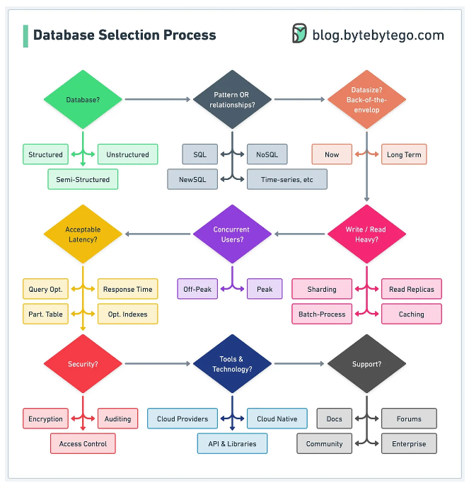
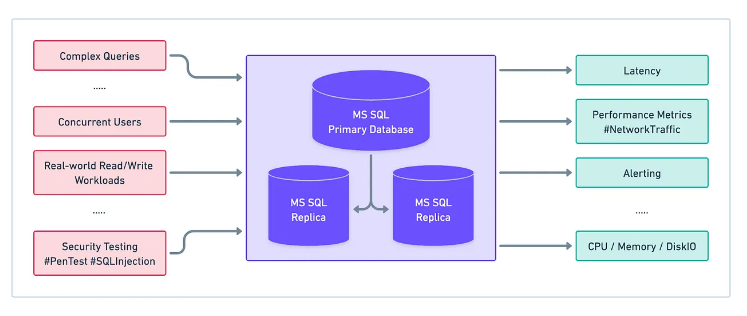
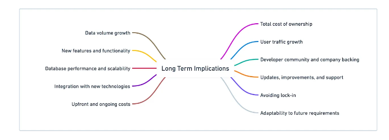

# Key Steps in Database Selection Process

https://blog.bytebytego.com/p/key-steps-in-the-database-selection

## Assessing Project Requirements

- Understanding the nature of the data will help us decide which type of database is more 
  appropriate
  - Structured?
  - Semi-structured?
  - Unstructured?
- Consider the expected volume of data the project will generate, both now and in the future
  - Estimate amount of storage required and rate at which new data will be added
  - Will help inform us on whether we need a database with high write performance or one that 
    can handle large amounts of data effectively
- What are anticipated number of concurrent users or connections
  - Determining max number of users or connections db must support, and how demand may fluctuate 
    during peak and off-peak hours
- Assess performance and security requirements
  - Are there any specific performance metrics, such as response time or query efficiency, that 
    are critical to the project's success
- Consider any existing systems, tools, or technologies that will need to integrate with the 
  chosen database
  - Do the database options under consideration offer support for integration with existing tech 
    stack

## Evaluating Database Options

- FOr each db on short list, investigate its features and capabilities in relation to the 
  project's needs
- To gain insight into the real-world performance of each database, consult user reviews, case 
  studies, and expert opinions
  - Look for how the database performs in similar projects or industries
- Consider each database's ecosystem and the resources available for devs
  - Want good documentation, tutorials, and support forums

## Performance Testing and Benchmarking

- Create a test env that closely resembles the prod env
  - Setting up same hardware, software, and network configuration that we expect to use in 
    actual project

- Design test scenarios that simulate realistic workloads for the project
  - Should cover a variety of use cases, such as reading and writing data, processing complex 
    queries, and handling concurrent users or connections
- During testing, measure and compare key performance metrics for each db
  - Read efficiency, read and write performance, and overall system responsiveness
- Once performance testing and and benchmarking completed, analyze results to identify trends or 
  patterns
  - Look for areas where particular db excels or struggles
  - How do strengths and weaknesses align with project requirements

## Consider Long-term Implications

- How might project change in the future
  - Increases in data volume, user traffic, and addition of new features

## Making the Final Decision

- Review info gathered
- Compare each database across scalability, performance, data consistency, data model, security, 
  cost, and community support
- Do we need to make any trade-offs to achieve the best overall fit for the project
- Decision must be based on comprehensive understanding of the project's requirements and 
  evaluation of available options
- We should continue to regularly evaluate how well the database is meeting the project's 
  requirements